<p align="center">
  
</p>

# Kaimahi

> **Incubation project.** Kaimahi is built in public. The README and
> documentation label capabilities as running in CI, demonstrated once,
> schema-valid only, proposed, or unbuilt. The name is settled on a
> stated basis — a cultural read cleared, no trademark opinion taken —
> see [docs/NAMING.md](docs/NAMING.md).

## Build and govern cloud-native AI agents on Kubernetes.

`kmx` is the developer entry point: an empty machine to a running,
conversational agent in minutes, scaffolded as YAML you can read, diff and
own.

Governance is the pillar underneath, not a bolt-on. Every model call, every
tool call and every event that triggers an agent passes through a plane that
meters it, bounds it, and records it — so delegating consequential work does
not mean giving up control.

That matters most when an agent is manipulated. In the
[accounts-payable demo](docs/ap-demo.md) an invoice instructs the agent that
it is pre-approved and that the payee has changed — and on the run that
documentation is written from, **the agent complied**. The call was refused
anyway, and the approval it had just been given could not be spent on it.

> **We do not promise the agent cannot be fooled. We promise that fooling it
> is not sufficient to move money.**

### Control model spend

Meter model calls, fail closed on monthly budgets, write every request to a
ledger, and keep real provider credentials away from agent pods.

### Constrain tool calls

Route MCP traffic through an enforcing gateway with explicit upstreams,
per-credential tool allowlists, and an audit trail that includes denials.

### Approve consequential actions

A denied action files a pending request that shows a human the **transaction**,
not the verb — `payment_schedule: amount_cents 3255000, payee_id MER-4471`.
Approval issues a grant bounded by expiry, by use count, and **by that exact
call**: the denial and the admitted call carry the same fingerprint, so what a
human approved is provably what ran. A grant with a use left cannot be spent on
a different call. (One closed exception: grants issued before argument binding
existed are honoured tool-wide. No new ones can be created, so that class only
shrinks.)

### Govern what triggers an agent

Let the outside world start an agent only through the plane: authenticated
before any work, rate- and size-bounded, replay-protected, spending previewed
against the budget, and each event consuming one bounded grant.

<p align="center">
  
</p>

The agents themselves run on **[kagent](https://kagent.dev)**, an
open-source runtime that makes an agent a Kubernetes resource: you
`kubectl apply` an `Agent` YAML, and its controller runs the pod, wires up
the model and the MCP tools, and ships a CLI and dashboard to talk to it.
Kaimahi governs that runtime rather than reimplementing it — it adds no
agent runtime of its own.

Governance is opt-in per agent. The documentation identifies ungoverned paths
and current limitations.

### Why not just kagent?

kagent runs the agent, and runs it well — which is why Kaimahi is thin over it
and adds no runtime of its own. It also already has a human-in-the-loop: mark a
tool `requireApproval` on the Agent and a person gets Approve/Reject before it
runs.

What that gate binds is the **tool**. Kaimahi binds the **call**: the approval
carries the arguments, so approving a $32,550 payment to one payee cannot be
spent on $48,000 to another, and the audit proves the approved call is the one
that ran. Around that sit the things a runtime has no reason to carry — a budget
that fails closed on model spend, policy on tool *arguments*, and a queryable
ledger of every call and denial.

If your agent reads a wiki, you need none of this; use kagent. If it moves
money, changes infrastructure, or emails a customer, the difference between
"approve this tool" and "approve this transaction" is the whole point.

### When this is the wrong tool

- **Your task is deterministic.** If a script or a scheduled job can do it,
  write that. This is for judgement work with consequences.
- **You do not want Kubernetes.** Kaimahi is thin over kagent, which is a
  Kubernetes runtime. There is no non-Kubernetes path.
- **You want to watch rather than enforce.** Tracing tools tell you what an
  agent did; this refuses a *governed* action beforehand. Governance is opt-in
  per agent and per seam, so what is not governed is not stopped — the docs
  name every ungoverned path. They complement each other, and we are not the
  one with the nice trace view.
- **You need agent inventory across employee laptops.** That is a different
  layer, and tools built for fleet-managing developer AI tooling do it better.

## Quickstart

**[`kmx`](docs/kmx.md) is the entry point** — one Go binary that drives
`kind`, `helm`, `kubectl` and the kagent CLI so a first agent takes minutes
instead of a prerequisite list. It carries the whole journey — `up`, `agent create`,
`agent chat`, `plane`, `govern`, `ledger`, `status`, `down` — and needs no
clone, because it fetches the plane at its own revision from the public Go
proxy.

```bash
# One command. A container engine is the only thing you need installed.
curl -fsSL https://raw.githubusercontent.com/kaimahi-agents/kaimahi/main/install.sh | sh -s -- --quickstart

# Or, if you have a Go toolchain and would rather build it:
go install github.com/kaimahi-agents/kaimahi/cmd/kmx@latest
kmx quickstart          # cluster + local model + kagent + an agent that answers
kmx up                  # the rest of the runtime (tool server, second agent)
kmx agent chat hello-world "Who are you?"

kmx plane             # the governance plane: metering proxy + spend ledger
kmx govern hello-world  # the agent now spends through it, on an issued credential
kmx agent chat hello-world "Who are you?"
kmx ledger            # what that answer cost, and to whom it was attributed
```

`kmx quickstart` ends with an agent answering a question — measured at **under
three minutes on a clean machine with one prerequisite** (Docker or Podman).
`kind`, `kubectl` and Helm are downloaded and checksum-verified by `kmx` itself
if the machine does not have them, the way it already acquires the kagent CLI.
Add `--output json` and it is drivable by an agent inside whatever harness you
are already using.

That is a real agent conversation with **no API key**: the cluster runs an
in-cluster Ollama model, and the governed half is keyless too. **Nothing on
that path is governed** — the plane is the next command, not a gate you pass
through first. Create your own agent with `kmx agent create <name>`, which
writes reviewable YAML and applies it.

`@latest` is the newest tagged release; `kmx version` tells you which one you
got. The install script verifies the release checksum before it installs
anything; the version scheme and the upgrade path are in
[docs/releases.md](docs/releases.md).

When the agent has earned a real cluster, `kmx lift` puts **the same agent** on
AKS in one command, with Azure-managed metrics, logs and a dashboard already
wired — and with the network boundary proven enforced before the governance
plane is put behind it. It bills money until `kmx lift down`, and it says so.
Bring your own cluster with `--byo`, where it never creates, deletes or adopts
anything of yours ([docs/aks.md](docs/aks.md)).

Continue with the [getting-started guide](docs/getting-started.md), or choose
a capability from the [documentation index](docs/README.md).

From a clone, `make` builds the same binary without touching a cluster;
provisioning stays explicit:

```bash
make        # build bin/kmx and print its path
make up     # kind cluster + local model + kagent + agents (~5–10 minutes)
make chat   # talk to the default agent
```

| Prerequisite | Needed for | Install |
|---|---|---|
| Docker **or** Podman | everything: kind runs Kubernetes in containers | <https://docs.docker.com/get-docker/> · <https://podman.io/docs/installation> |
| kind, kubectl, Helm | fetched and checksum-verified by `kmx` when absent — yours are used if you have them | — |
| Go 1.26+ | only `kmx plane` (it builds the plane's image locally) and `go install` | <https://go.dev/dl/> |
| make, git | only the clone path below | your package manager |

```bash
make chat TASK="What are you defined in?"
make chat AGENT=hello-tools TASK="What pods are running in the ollama namespace?"
make govern                              # route the agent's model calls through the governed proxy
make status                              # grouped agents, models, runtime health, next actions
make down                                # delete the cluster
```

`make chat` delegates to kmx, which acquires the pinned kagent CLI in its
cache (checksum-verified), port-forwards the controller, and invokes the agent.

| Consume it as | How |
|---|---|
| **Local dev** | `make up` on kind; keyless, free, offline-capable model |
| **Any conformant cluster** | the manifests are plain CRDs; **AKS** is the named managed target, and the governance plane has been [run there once](docs/aks.md) |
| **CI / automation** | the same targets run headless — this repo's [CI](.github/workflows/ci.yml) boots a cluster and asserts a real reply, and a real tool call, on every PR |
| **Your own repo** | copy `k8s/` + the make targets; each agent is one YAML file |
| **Existing kagent install** | `kubectl apply -f k8s/hello-world.yaml` — no kaimahi runtime required |

## Status

| # | Phase | State |
|---|---|---|
| 1 | Hello world on Kubernetes | **runs** — `make up && make chat`, verified in CI |
| 2 | Hosted LLM endpoints via ModelConfig | **runs** — presets below |
| 3 | Connectors/tools via MCP | **runs** — `hello-tools`, real tool call asserted in CI |
| 4a | Governed LLM spend (proxy, budgets, ledger, custody) | **runs** — `make govern`, denial + ledger asserted in CI |
| 4b | Governed tool calls (MCP gateway, allowlists, audit) | **runs** — `make govern-tools`, denial + audit asserted in CI |
| 4c | Approvals / time-boxed permits (deny-and-pend, bounded grants) | **runs** — `make approvals`, both cycles asserted in CI |
| 5a | Governed Slack outbound — posting is an approved action | **runs** — `make govern-slack`; the deny → approve → post → burn cycle asserted keyless in CI ([docs/slack.md](docs/slack.md)) |
| 5b | Cluster portability + a real managed-cluster run | **demonstrated once** — the plane, a governed Copilot chat, a ledger row, a budget denial and a governed tool call, all on a real AKS cluster, which was then deleted ([docs/aks.md](docs/aks.md)) |
| 7a | Network policy around the plane | **runs** — default-deny NetworkPolicy in both directions, proven by a probe on every PR ([docs/egress.md](docs/egress.md)) |
| 7b | Inbound hooks (webhooks → agent), governed | **runs** — auth before any work, budget checked at the door, a bounded grant consumed per event, probed keyless in CI; the pre-auth rate limiter and the queue are per replica by design ([docs/inbound.md](docs/inbound.md)) |
| 8 | Approvals routed to Slack, with the approver's identity | **runs** — a filed request is announced in the channel through the plane's own governed post; `@kaimahi approve <id>` from a listed approver mints the grant in their name, asserted keyless in CI with signed synthetic mentions; live verification on AKS pending ([docs/approvals.md](docs/approvals.md#deciding-from-slack)) |
| 9 | Run it for real: two stateless replicas, exact budgets, metrics | **runs** — two replicas behind every seam, every budget and grant decision serialized per credential in Postgres (N concurrent calls against a cap with room for one admit exactly one, asserted across both replicas in CI), a replica killed mid-cycle and Postgres restarted without a proxy restart, migrations under a lock, Prometheus on its own port, `make backup` / `make restore` ([docs/operations.md](docs/operations.md)) |
| 10 | Hosted tool upstreams — the gateway reaches GitHub's MCP server on the internet through one hardened dialer | **runs** — `make github-secret` → `make govern-github`; the dialer's refusals, a synthetic public upstream, the opt-in allowance and the fail-closed negative asserted keyless in CI; GitHub itself verified once on kind ([docs/hosted-upstreams.md](docs/hosted-upstreams.md)) |
| 12 | Argument-level policy — an approval binds the CALL, and standing constraints let routine calls through | **runs** — a tool declares which argument fields are policy-relevant; a credential may carry declarative bounds on them (a call inside proceeds with no human, one outside is denied and files a request); the request, the grant and the audit carry the call's digest and a readable summary, so an approval for one transaction cannot be spent on another. Asserted keyless in CI ([docs/approvals.md](docs/approvals.md#the-approval-binds-the-call)) |
| 11 | `kmx` — the developer journey as one command | **runs** — `go install …/cmd/kmx@latest`, then `kmx up`, `kmx agent create`, `kmx agent chat`, `kmx plane`, `kmx govern`, `kmx ledger`, `kmx status`, `kmx down`; the Makefile's kind path delegates to it, so CI proves it on every PR, and a post-merge job drives the whole journey from an installed binary with no checkout ([docs/kmx.md](docs/kmx.md)). Milestone 3: the runtime, the plane, **and** the operator verbs — `use`, `budget`, `approvals`/`approve`/`deny`/`request`, `tools`, `backup`/`restore`, `metrics` — on kind |

| 32 | **Used for real**: an agent helps cut releases of a real project | **runs** — one command drafts the notes from what merged since the last release and proposes the branch and the builds; cutting the branch and publishing are denied, filed naming the version and the repository, approved by a human, and admitted under a grant welded to that call, while build dispatch runs under a standing constraint bounded to named pipelines. The driver does the waiting. Asserted keyless in CI against the synthetic hosted upstream, including that a consolidated dispatcher is governed by its action rather than its name ([docs/release-agent.md](docs/release-agent.md)) |
| 13 | Tagged releases, a verified download, and a proven upgrade | **runs** — CI builds four platforms from the tag with `checksums.txt`, refuses a tag whose version has no changelog section or whose binary does not report its own tag, and upgrades a two-migration-old plane with live data in it on every PR; the failure case (a migration that cannot apply) is documented and asserted ([docs/releases.md](docs/releases.md)) |
**Limitations, stated plainly.** The plane does not stop an agent being
manipulated; it stops a manipulated agent acting outside the call a human
approved, and it governs tool INPUTS only — nothing filters or redacts a
tool's results. Governance is opt-in per agent: an
*ungoverned* preset still bills with no ledger, and an ungoverned tools wiring
still acts with no audit. The plane's namespace is default-deny in both
directions and the Slack pod is the one thing allowed out, on 443 only; the
`kagent` and `ollama` namespaces are not policed. Internet-facing tool
upstreams remain unbuilt; Slack is the only chat route for approvals (the
`make approve` path remains, recording `admin`). The plane runs as two
stateless replicas that agree on every decision in Postgres; Postgres
itself is one replica with `make backup` / `make restore`, not a highly
available database ([docs/operations.md](docs/operations.md)).

Cloud-agnostic — it runs on any conformant Kubernetes — with first-class
attention to the Azure path: **AKS** as the managed target, **Azure AI
Foundry** among the model endpoints. On AKS, be precise about what that means.
It has been **demonstrated, not maintained**: one verified run on 2026-09-01,
then torn down. There is no standing cluster and no Azure credential in CI —
the repo is public and fork-exposed, so CI stays on kind and keyless,
re-proving the portability *logic* (the context guard's decisions, the
registry render) on every PR rather than the cloud itself.

## Documentation

[docs/demo.md](docs/demo.md) is the demo start to finish, with what each
step should print, and [docs/ap-demo.md](docs/ap-demo.md) is the one that
puts it on money — an accounts-payable agent that resolves an invoice
three-way matching cannot, and still has to ask a person before any of it
moves. [docs/README.md](docs/README.md) routes by what you want
to do, and holds the one table of what is governed today and what is not:
[getting started](docs/getting-started.md), [hosted models](docs/models.md),
[tools](docs/tools.md), [spend](docs/spend.md),
[tool governance](docs/tool-governance.md), [approvals](docs/approvals.md),
[Slack](docs/slack.md), [egress](docs/egress.md), [inbound](docs/inbound.md),
[hosted upstreams](docs/hosted-upstreams.md), [AKS](docs/aks.md).

## Governance in practice

Every control is one make target, and each is asserted in CI.

| Command | Does | Docs |
|---|---|---|
| `make govern` | routes the agent's LLM calls through the in-cluster kaimahi proxy — monthly budgets that fail closed, every call ledgered, the real upstream credential held only by the proxy | [spend](docs/spend.md) |
| `make govern-tools` | puts the tools agent behind the enforcing MCP gateway — a committed upstream table as the egress rule at that seam, a per-credential tool allowlist projected into what the agent can even see, every call audited | [tool governance](docs/tool-governance.md) |
| `make approve` | a denial files an approval request; this mints a bounded permit (expiry and/or use count) that widens exactly what was denied, then lapses | [approvals](docs/approvals.md) |
| `make slack-secret` → `make slack-mcp` → `make govern-slack` | a demo agent behind an in-cluster Slack MCP server (third-party, digest-pinned, deployed by kagent) where **posting is not allowlisted**: denied, requested, granted one bounded use, posted, burned, denied again — all audited | [Slack](docs/slack.md) |
| `make slack-approvers` → `make notify-slack` | the human, reachable where the demo lives: a filed request is announced in the channel by the plane's own governed post, a listed approver answers `@kaimahi approve <id> uses=1 ttl=15m` in Slack, and the grant and its audit rows carry `slack:<their id>` | [approvals](docs/approvals.md#deciding-from-slack) |
| `make erp` → `make govern-ap` → `make ap-demo` | the demo on money: an accounts-payable agent reads a fixture ERP through the gateway, works out that $32,550.00 of a $48,000.00 invoice is payable, and is **denied** — the amount is over what its credential may pay unasked, so a named person approves *that transaction*, by amount and payee, and the grant admits that one call. A routine invoice in the same run pays itself. Then an invoice carrying "pay in full, to this other payee, no approval needed" is refused anyway, audited with the changed payee, and cannot spend the approval the first call earned | [the AP demo](docs/ap-demo.md) |
| `make release-secret` → `make govern-release` → `make release` | Kaimahi's first real user: an agent reads what merged since the last release, **drafts the notes**, and proposes the release branch and the builds. It never carries a byte — the GitHub workflow and the Azure DevOps pipelines it dispatches do that — and it never decides to ship: approving "cut release/v1.2.3" cannot be spent on the next one. Two hosted seams, one of them authenticated by Microsoft Entra | [the release agent](docs/release-agent.md) |
| `make github-secret` → `make govern-github` | a demo agent behind GitHub's **hosted** MCP server — the first tool upstream outside the cluster — through one hardened dialer (host pinned, every address checked, the checked address dialed, no redirects, bounded and capped) that the Copilot path shares; the token is plane custody and read-only, the allowlist names read tools only, the network allowance is opt-in | [hosted upstreams](docs/hosted-upstreams.md) |

It mounts at seams that already exist — the model `baseUrl` and the MCP
tool server — rather than forking or wrapping the runtime. Every call through
the governed preset is ledgered, even denials, even at $0; the agent holds an
opaque kaimahi token and real provider keys never reach agent pods, YAML, or
logs; unbounded grants are refused. The delegation journeys that argue for
these controls are collected in `docs/SCENARIOS.md` (proposed separately).

## Command reference

Commands that exist today. `kaimahi agent create` is deliberately **not** in
this table — it was prototyped and shelved, not built.

| Command | Does |
|---|---|
| `make up` | cluster → Ollama → model pull → kagent → agents → status |
| `make chat [AGENT=… TASK=…]` | one question to an agent via the kagent CLI |
| `make status` | grouped context, agent/model wiring, runtime health, restarts, and next actions |
| `make down` | delete the kind cluster |
| `make use PRESET=<name>` | point the agent at a model preset from `k8s/models/` |
| `make use-ollama` | back to the keyless in-cluster model |
| `make model-secret NAME=<secret>` | store an API key from **stdin only** |
| `make copilot-secret` | GitHub device login → short-lived Copilot token → Secret |
| `make tools-agent` | apply the MCP tools-enabled agent |
| `make model MODEL=<tag>` | pull another Ollama model (also edit `model:` in the YAML) |
| `make aks-cluster` / `make aks-down` | create / **delete** an ephemeral AKS cluster + private ACR |

Overridable: `KIND_CLUSTER`, `KAGENT_VERSION`, `MODEL`, `AGENT`, `TASK`,
and `TARGET` (`kind` by default, or `aks`).

**Targeting a real cluster.** `KUBE_CTX` is overridable, so `make down`
can name a cluster somebody cares about. Every target that *writes to
a cluster* therefore prints the context, API-server host and namespaces it
is about to touch, and requires an explicit confirmation naming the
context when that context is not a local kind cluster — fail closed, no
confirmation no action. Read-only targets never prompt, and the Azure
provisioning/teardown targets carry their own gates instead. See
[docs/aks.md](docs/aks.md).

## The artifact: agent as code

[`k8s/hello-world.yaml`](k8s/hello-world.yaml) is the whole agent — the model
it thinks with and the agent itself, in one reviewable document:

```yaml
apiVersion: kagent.dev/v1alpha2
kind: Agent
metadata:
  name: hello-world
  namespace: kagent
spec:
  type: Declarative
  declarative:
    modelConfig: hello-world-model
    systemMessage: |
      You are Kaimahi's hello-world agent, running on Kubernetes via kagent.
      ...
```

`kubectl apply -f` it and the controller provisions the agent. The topology
grows the same way it started — as YAML you can diff:
[`k8s/tools-agent.yaml`](k8s/tools-agent.yaml) is the hello-world agent
plus a `tools:` block wiring it to an MCP server, and the hello-world
artifact itself is never mutated. Agents run on kagent — declarative Kubernetes agents whose
Agent CRD YAML *is* the topology artifact.

**The north star: Kaimahi is thin glue over `kind`, `helm`, `kubectl`, and
the kagent CLI.** Build nothing that can be delegated. Every component has
to earn its existence by being something no upstream provides.

The tooling holds to that literally. `kmx agent chat` is a passthrough to
`kagent invoke`, there is no `kmx install`, and reading, updating and
deleting agents stay with `kubectl` — an entry point that grew into a
second control plane would be exactly the failure this star steers away
from.

The governance plane is what remains after delegating everything that
could be delegated: the credentials, budgets, allowlists, grants and audit
trail that neither Kubernetes nor the runtime provides. It is held to the
same standard — every package answers why it is not configuration — and it
is the honest measure of whether the star is being followed.

## Model endpoints

Each endpoint is a committed kagent `ModelConfig` preset in
[`k8s/models/`](k8s/models/); one command switches the agent between them.

```bash
make model-secret NAME=anthropic-api-key   # stdin only — never argv, YAML, or logs
make use PRESET=anthropic
make chat
```

| Preset | Endpoint | Secret | Live-verified |
|---|---|---|---|
| `ollama` | in-cluster, keyless, free | — | **yes** (e2e in CI) |
| `github-copilot` | Copilot subscription models | `make copilot-secret` | **yes** (`gpt-5-mini`) |
| `anthropic` | Anthropic API | `anthropic-api-key` | schema-valid only |
| `openai` | OpenAI API | `openai-api-key` | schema-valid only |
| `openrouter` | OpenRouter gateway | `openrouter-api-key` | schema-valid only |
| `azure-foundry` | Azure AI Foundry (v1 GA) | `azure-foundry-api-key` | schema-valid only |
| `openai-compatible` | any OpenAI-compatible base URL | `openai-compatible-api-key` | schema-valid only |

"Schema-valid only" is literal: CI dry-runs every preset against the live
CRDs, but no real completion has been bought through it yet. Details and
caveats: [docs/models.md](docs/models.md).

## Tools

`hello-tools` reaches an MCP server through `spec.declarative.tools`. The
server is locked down at three layers: k8s tools only, `--read-only`, and a
get/list/watch ClusterRole that **cannot read Secrets**, with a single-tool
allowlist on top. Details: [docs/tools.md](docs/tools.md).

## One command: `kmx`

CLI before UI, deliberately. The journey — provision, deploy, converse,
create an agent, tear down — is one binary, installed with `go install`
and needing no clone:

```bash
kmx up
kmx agent create fleet-reporter --tools kagent-tool-server:k8s_get_resources
kmx agent chat fleet-reporter "What is running in the ollama namespace?"
kmx down
```

Once the plane is up it is also the operator's command — the budget an agent
spends under, the approvals waiting for a human (each showing the *call* it
is about), the tool allowlist, the database backup, one replica's metrics.

It duplicates nothing kagent's own CLI ships: `kmx agent chat` is a
passthrough to `kagent invoke`, there is no `kmx install`, and reading,
updating and deleting agents print the `kubectl` command that already does
the job. The Makefile's equivalents now call this binary, so there is one
implementation and CI proves the code you run. Nothing is published, and
neither `kmx` nor `kaimahi` is claimed as a package name.

What it is, what it refuses and what it deliberately leaves to the Makefile:
[docs/kmx.md](docs/kmx.md). The original survey against kagent's CLI, which
still binds, is [docs/CLI-PROPOSAL.md](docs/CLI-PROPOSAL.md).

## Development

Start with [CONTRIBUTING.md](CONTRIBUTING.md). Work is coordinated through
[docs/COORDINATION.md](docs/COORDINATION.md). Every change lands via a PR to
`main` with CI green, and verification claims are backed by actually running
the thing.
